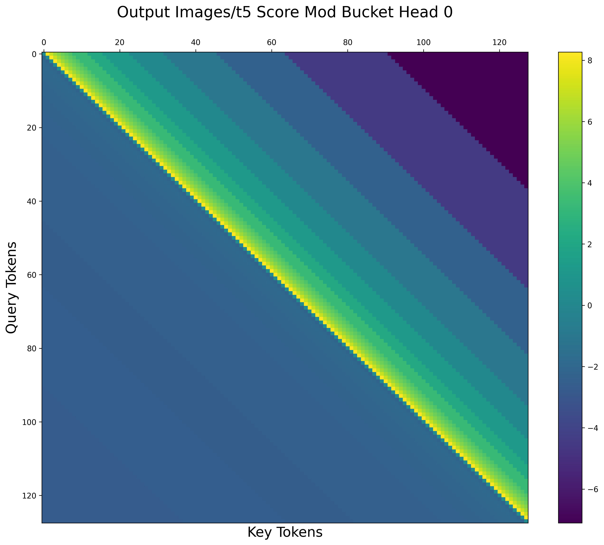

# T5 + FlexAttention


This project implements T5's bucketed relative position bias using [FlexAttention](https://pytorch.org/blog/flexattention/), a new PyTorch feature that allows for flexible and efficient attention operations.

## Prerequisites
- PyTorch (version 2.5 or higher)
- huggingface transformers

## Attention Gym

`gym.py` implements t5's position bias in flex attention, using the [Attention Gym](https://github.com/pytorch-labs/attention-gym) repository for visualization.

<div style="display: grid; grid-template-columns: repeat(4, 1fr); gap: 10px;">
    
    
    
    
    
    
    
    
</div>


## Integrate flex attention into huggingface T5

- A simple monkey patching implementation is provided in `patch_hf_t5.py`.

## Check for correctness
```
python test_correctness.py
```
note: the trained weights can cause more than 1% difference in the output, so some tests require re-initialized weights. (notice in the visualization above some biases are relatively large (~8))

## Benchmark

```
bash run.sh # this runs `benchmark.py` a few times and generates some files.
```
- output files:
    - `trace*.json` files, go to chrome and open `chrome://tracing/`, click "Load" and select the json file.
    - `memory_snapshot*.json` files, go to `https://pytorch.org/memory_viz`, drag and drop the json file.
    - `log.txt`: benchmark results

- setting: B=1, L=1024, model=google/t5-v1_1-xxl


<details>
  <summary>📊 Show Performance Table</summary>

  | Configuration (B=1, L=1024, model=google/t5-v1_1-xxl) | Time (RTX3090) | Time (A100) |
  |--------------------------------------------------------|----------------|-------------|
  | Baseline                                               | 294 ms         | 156 ms      |
  | Baseline + Compile                                     | 174 ms         | 63 ms       |
  | Flex Attention + Compile                               | 160 ms         | 55 ms       |
  | (w/ mask) Baseline                                     | 294 ms         | 157 ms      |
  | (w/ mask) Baseline + Compile                           | 166 ms         | 54 ms       |
  | (w/ mask) Flex Attention + Compile                     | 147 ms         | 47 ms       |

</details>

## Limitations

1. Currently score_mod captured tensors does not support gradient. (as of Sep 2024, torch nighlty)
2. There is a memory leak when running flex_attention() without any compile.

<details>
  <summary>📊 Details</summary>

  | Configuration (B=1, L=1024, model=google/t5-v1_1-xxl) | Time (RTX3090) | Time (A100) |
  |--------------------------------------------------------|----------------|-------------|
  | Baseline                                               | 294 ms         | 156 ms      |
  | Baseline + Compile                                     | 174 ms         | 63 ms       |
  | Flex Attention + no Compile                            | memory leak    | memory leak |
  | Flex Attention + Compile noly flex_attention           | 185 ms         | 70 ms       |
  | Flex Attention + Compile noly forward                  | 186 ms         | 73 ms       |
  | Flex Attention + Compile whole model                   | 160 ms         | 55 ms       |
</details>
- run `bash run_memory_leak.sh` to get the results.


##  License

This project is dual-licensed:
- MIT License: All files except gym.py
- BSD 3-Clause License: gym.py (adapted from Attention Gym)